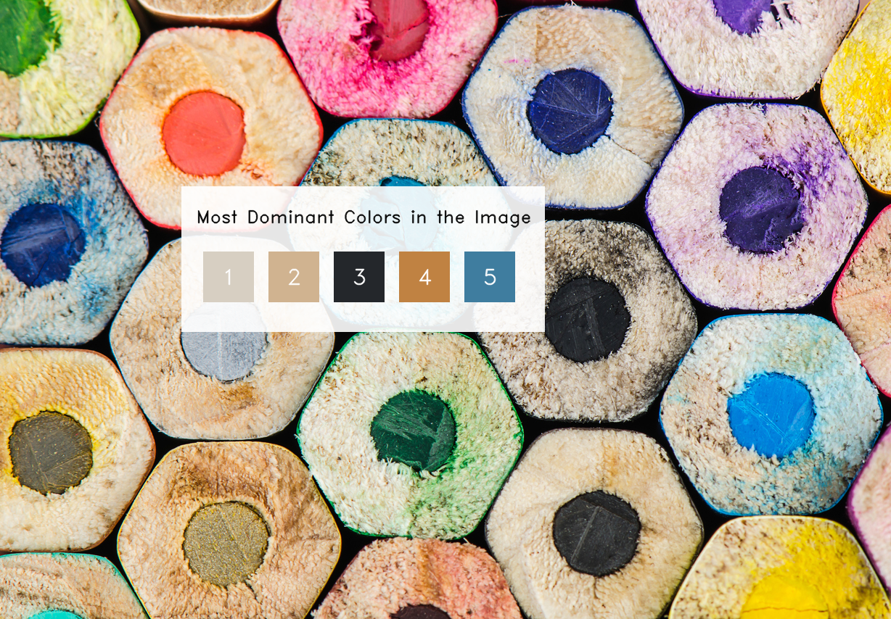

# TSF GRIP SEPTEMBER 2023 CV-IOT TASK 2

## Color Detection Model for Images and Videos (CDM)

### Color Clustering and Visualization

This repository contains Python code for color clustering and visualization of dominant colors in an image.

This code uses the following libraries and techniques:

- OpenCV (`cv2`) for reading and manipulating images.
- NumPy (`numpy`) for array manipulation.
- Matplotlib (`matplotlib`) for plotting and visualization.
- Scikit-learn's KMeans clustering algorithm (`sklearn.cluster.KMeans`) for color clustering.
- `imutils` for image resizing.

### Usage

1. Specify the number of color clusters (`clusters`) you want to identify.
2. Load the input image using `cv2.imread()` and create a copy.
3. Resize the image for processing using `imutils.resize()`.
4. Flatten the image to prepare it for KMeans clustering.
5. Apply KMeans clustering to identify dominant colors in the image.
6. Visualize the dominant colors and their percentages using Matplotlib.
7. Create a color bar and display the most dominant colors.
8. Resize and annotate the original image to display the top colors.

### Example

In the example above, the code identifies the top 5 dominant colors in the input image and visualizes them in a color bar and annotated image.

### Requirements

- Python 3.x
- OpenCV (`cv2`)
- NumPy (`numpy`)
- Matplotlib (`matplotlib`)
- Scikit-learn (`sklearn`)

### Check out Video Demonstration of this Project on my YouTube Channel:

> [Take me there](https://youtu.be/331nMNjQZik)

### Author

Darshan S
> Contact me @ [LinkedIn](https://linkedin.com/in/arcticblue/) | [Instagram](https://instagram.com/thedarshgowda) | [Email](mailto:d7gowda@gmail.com)
